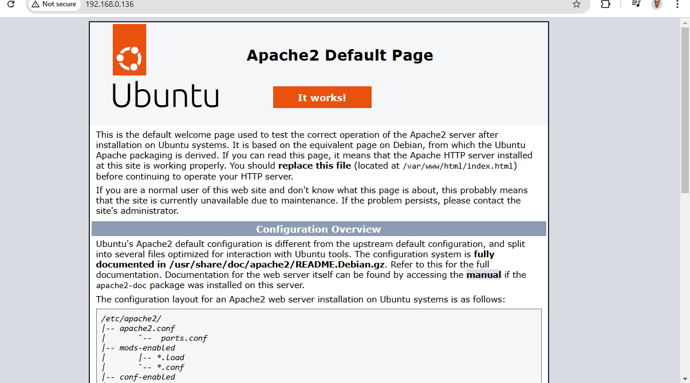
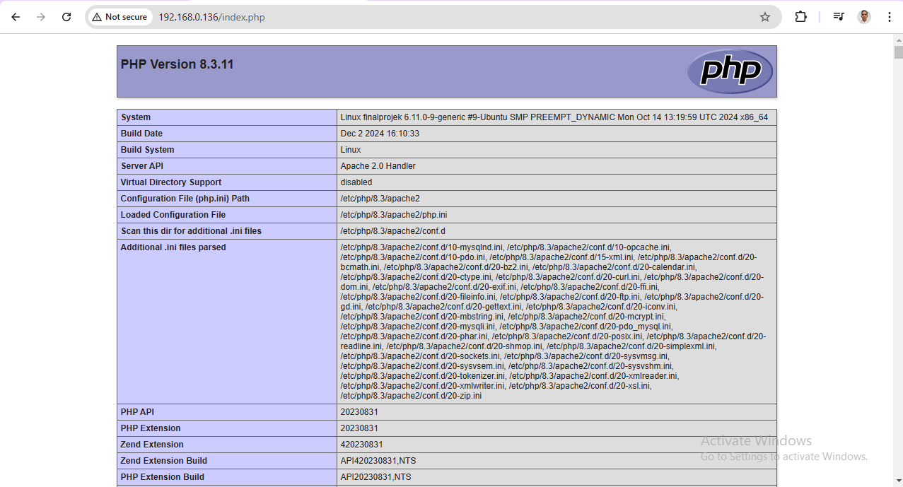
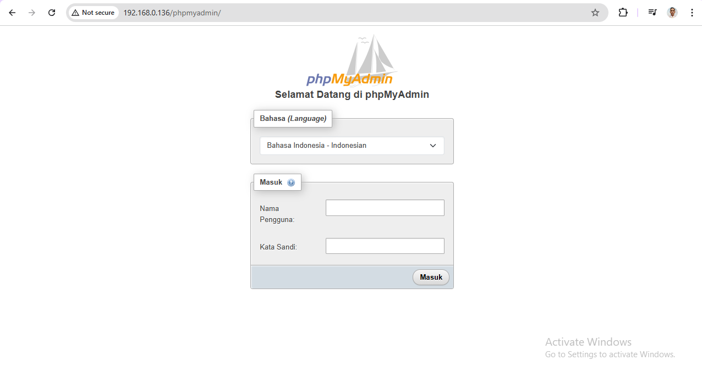

# Web Barang Kehilangan Berbasis Webserver

## Final Project by Ahmed Yopan Ardyan
- **NIM:** 20.83.0501

## Layanan yang Digunakan
- SSH Server
- PHP
- phpMyAdmin
- Apache2
- MySQL Server

---

## Cara Penginstalan

### 1. Instalasi Apache2
1. Update repository:
   ```bash
   sudo apt update
   ```
2. Install Apache2:
   ```bash
   sudo apt install apache2 -y
   ```
3. Cek status Apache2:
   ```bash
   sudo systemctl status apache2
   ```
4. Buka browser dan akses `http://<IP_ADDRESS>` untuk memastikan Apache2 terinstal dengan benar:

   

### 2. Instalasi PHP
1. Install PHP:
   ```bash
   sudo apt install php libapache2-mod-php -y
   ```
2. Verifikasi instalasi PHP:
   ```bash
   php -v
   ```
3. Buat file uji coba PHP:
   ```bash
   echo '<?php phpinfo(); ?>' | sudo tee /var/www/html/index.php
   ```
4. Akses `http://<IP_ADDRESS>/index.php` di browser untuk memeriksa versi PHP:

   

### 3. Instalasi MySQL Server
1. Install MySQL Server:
   ```bash
   sudo apt install mysql-server -y
   ```
2. Jalankan MySQL Secure Installation:
   ```bash
   sudo mysql_secure_installation
   ```
3. Login ke MySQL:
   ```bash
   sudo mysql -u root -p
   ```

### 4. Instalasi phpMyAdmin
1. Install phpMyAdmin:
   ```bash
   sudo apt install phpmyadmin -y
   ```
2. Pilih server web: Apache2.
3. Konfigurasi phpMyAdmin untuk Apache:
   ```bash
   sudo ln -s /usr/share/phpmyadmin /var/www/html/phpmyadmin
   ```
4. Akses `http://<IP_ADDRESS>/phpmyadmin` di browser untuk memeriksa instalasi:

   

### 5. Aktivasi SSH Server (Opsional)
1. Install OpenSSH Server:
   ```bash
   sudo apt install openssh-server -y
   ```
2. Cek status SSH Server:
   ```bash
   sudo systemctl status ssh
   ```
3. Akses server melalui SSH:
   ```bash
   ssh <user>@<IP_ADDRESS>
   ```

---

## Penutup
Website ini dibuat untuk membantu pengguna dalam melacak barang-barang yang hilang. Semua layanan di atas diintegrasikan untuk membangun platform yang andal dan user-friendly.

### Gambar-Gambar Pendukung
- [Apache2 Default Page](./Apache2.png)
- [PHP Info Page](./php.png)
- [phpMyAdmin Page](./phpmyadmin.png)

